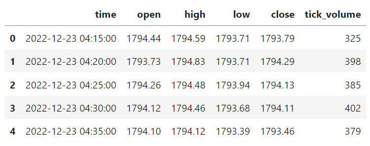
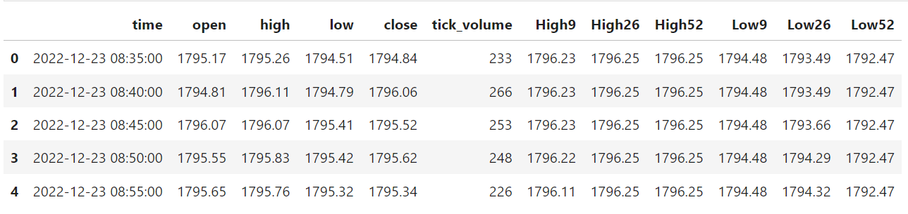
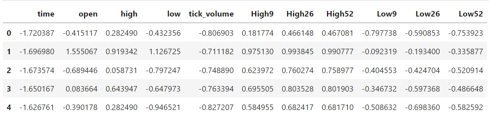
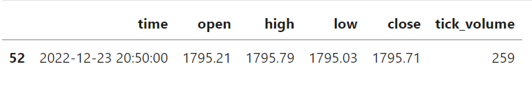
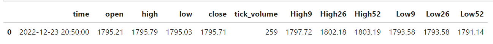
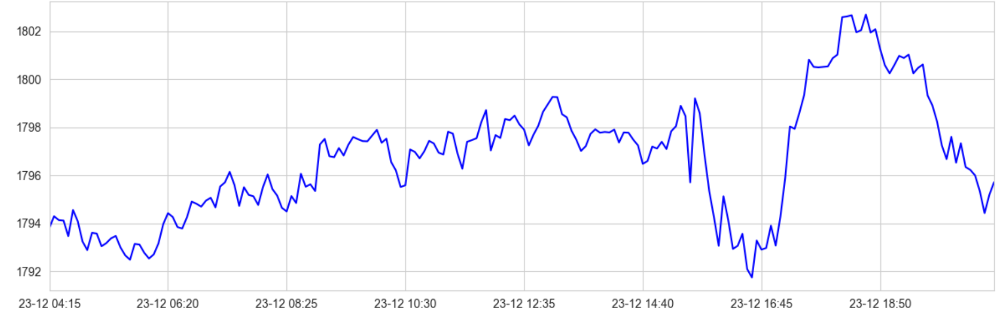
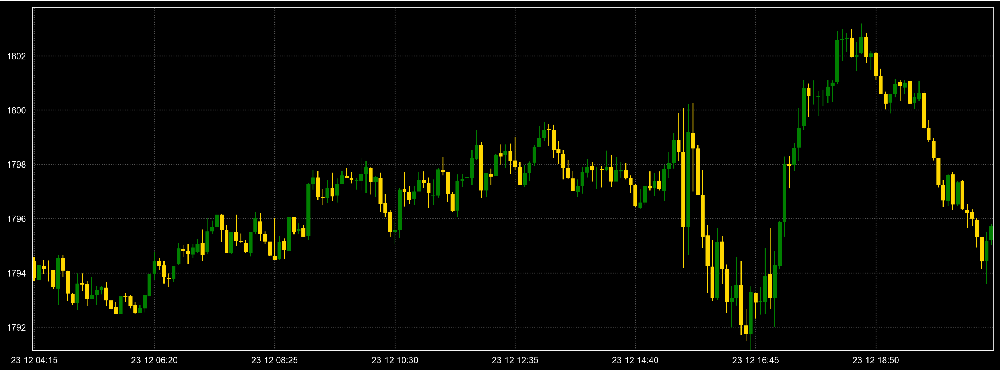

# inputs data from Stock Markets and Trade in it
## In this Package we try input data and trade in stock markets base on Metatrader5
(for Now and later maybe we add other options )

#
## Using this Package is too easy:
+ Befor use you should--> [pip install MetaTrader5](https://pypi.org/project/MetaTrader5/)

+ and you Should [install MT5](https://www.metatrader5.com/en/download) on your PC and create acount(free and easy)

Now -->
just add libraries next to your code and simply use it    
Example (ReadData):
    
```python
from ReadData import MetaTrader
my_obj = MetaTrader("XAUUSD", "M1",start_pos=1, count=200)
# Get Last 200 candles data From timeframe M1 and symbol 'XAUUSD'
df=my_obj.df_raw # This is a Pandas Dataframe
df.head()
```


## we have 3 type of datafram
+ df_raw
+ df_raw_type1   --> this df has Low9,Low26,Low52 and High9,High26,high52
+ df_type1_changed --> this is normalized and scaled data from df_raw_type1

Here is df_raw_type1:


and this is df_type1_changed:



and also we can use
```python
my_obj.update() # This function will update the databases  
my_obj.update_last() # This function will update only last databases  
```
## After we use our dataframes (for example in sklearn) now we need only last candles data and they here-->
```python
my_obj.update_last()
my_obj.df_last_candle_raw
```

```
my_obj.df_last_candle_type1
```

```
my_obj.df_last_candle_type1_changed
```


#
# Now its time to visualizing data
## this part is easy too -->

```python
from Visualize import plot_line,plot_candlestick
plot_line(my_obj.df_raw) # its done :D
```


```python
plot_candlestick(my_obj.df_raw)
```



#
# Now its time To Trade:

## class trade has many fanctions like:
+ order_send
+ close_position
+ close_sells
+ close_buys
+ close_all
+ positions_total
+ positions_total_buy
+ positions_total_sell
+ terminal_info

## Example of using Trade:

Example (Trade):
```python
from Trade import TradeOnMeta
MT=TradeOnMeta()
df=MT.positions_total_buy("XAUUSD")
# Get get all buy positions from symbol 'XAUUSD' --> Pandas Dataframe
MT.close_all("BITCOIN") # Close All positions in 'BITCOIN'
MT.order_send("BITCOIN",'Buy',lot=0.25, sl=12000, tp=20000) # Open Trade in 'BITCOIN'
MT.close_sells()# Close All sell position from all symbols
...
```
#
### under development ...
* < we will come back soon >